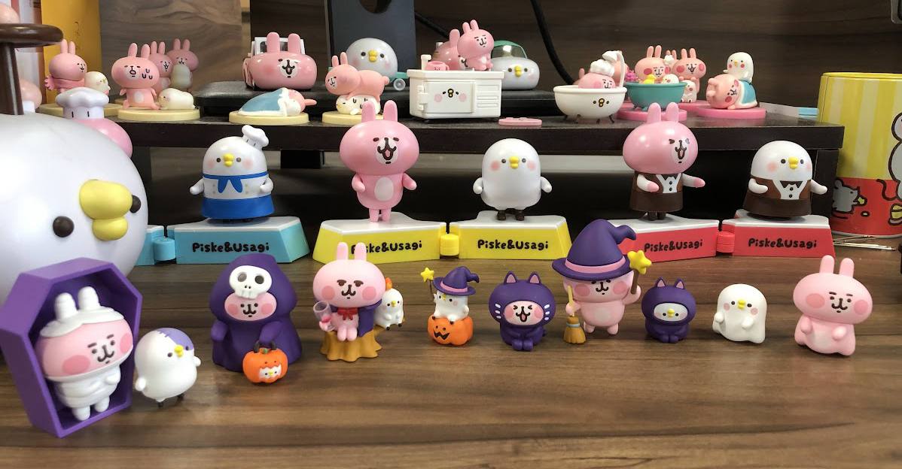

## Hello there I am Nick !

### About Me 👋

>   一名正在努力生存的前端工程師，非常喜歡 Kanahei&Piske(附上班照~)

### 💡 Languages and 🔧 Tools

  
  
  
  
  
  
  
  
  
  
  
  
  
  
  
  
  
  
  
  
  
  
  
  
  

### 🔍 Interst
- Pinia | TailwindCss | Vite | Nuxt3

