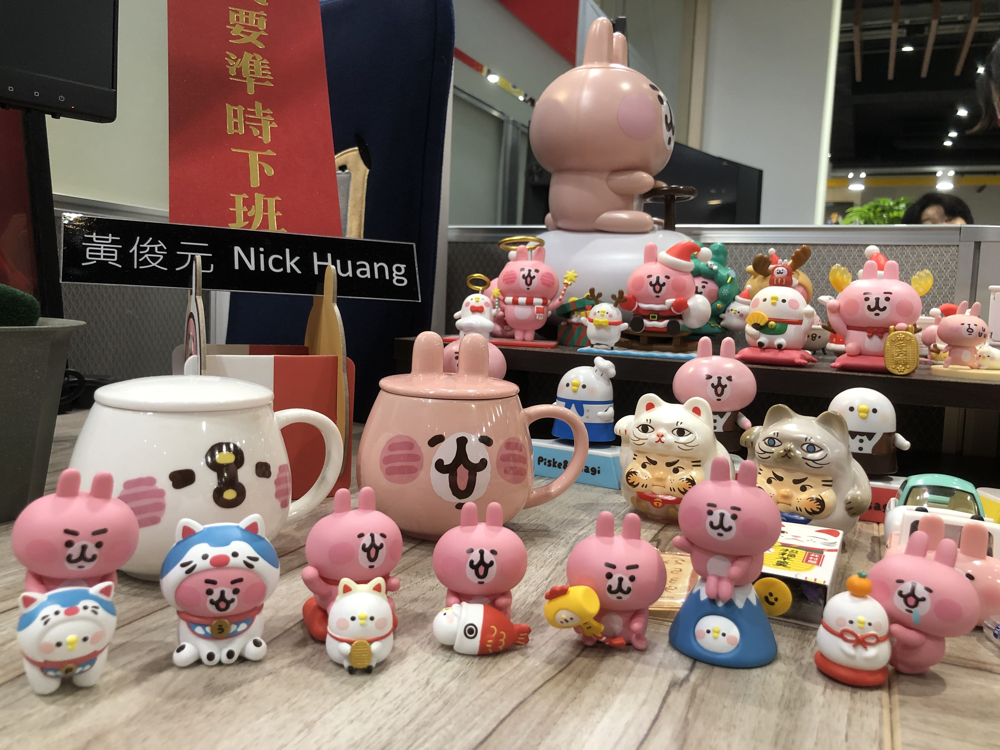
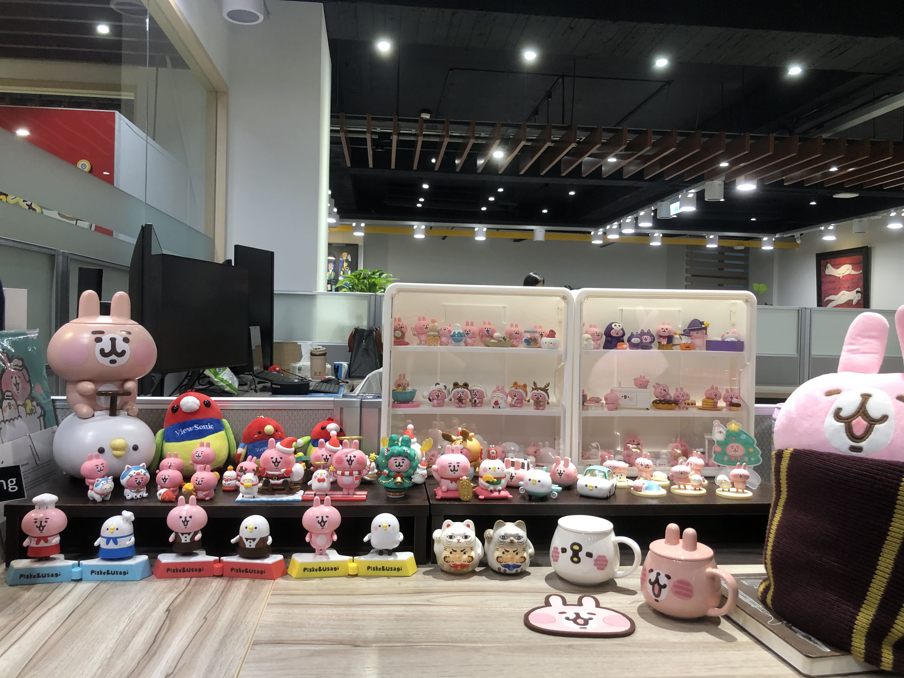
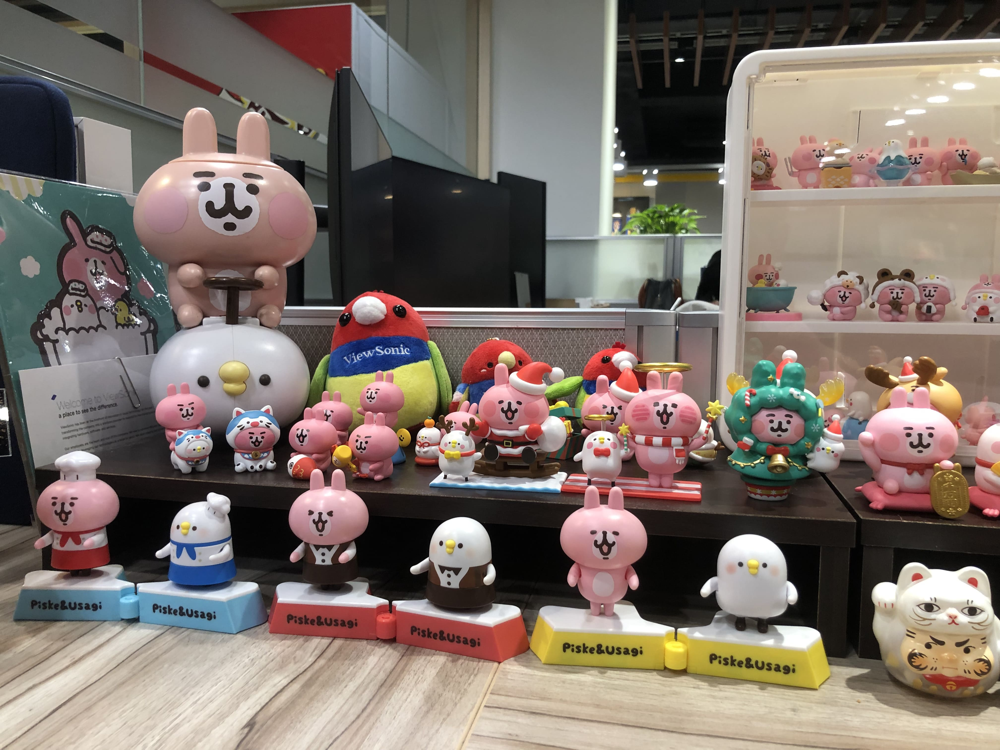
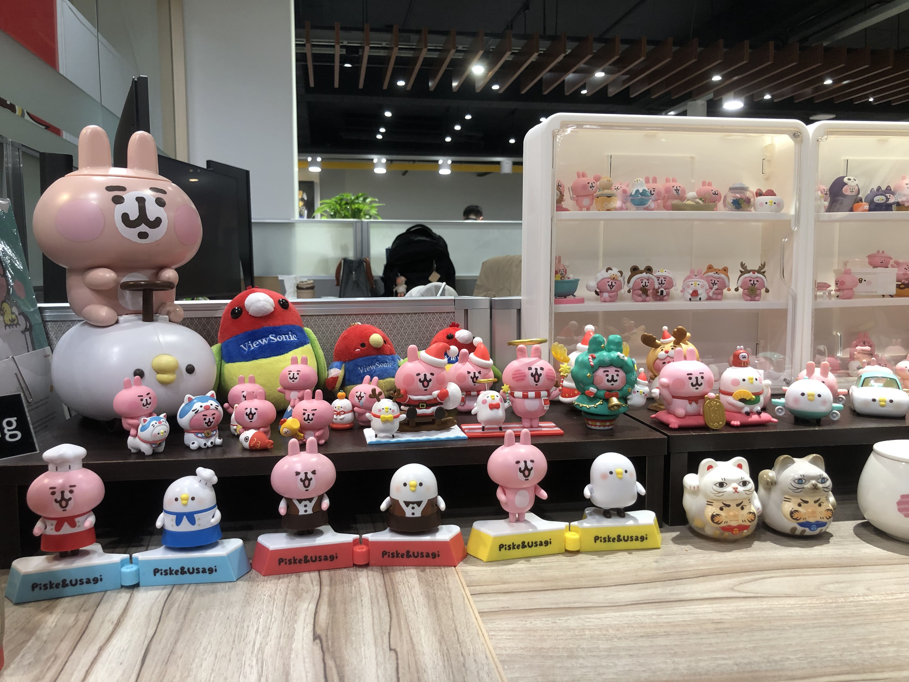

  
  
  

### 🧑‍💼 Workday Snapshots

  
  
  
  

---

### 🚀 Main Skills

  
  
  
  

---

### 🛠 Tools & Libraries

  
  
  
  
  
  
  
  
  
  
  
  
  
  
  
  
  
  
  
  
  
  
  
  

---

### 🧑‍💻 About Me

👋 Hello there I am Nick ! A frontend engineer trying to survive, and a huge Kanahei & Piske fan (office photos above!) 🐰🐥

---

### ✨ Highlights

Frontend planning and development experience taking service products and content platforms from 0->1 and 1->N across desktop and web.

---

### 📚 iThome Series
- 🏅 2025 iThome excellent work - [牛郎工程師：30 天練成情緒價值與交付感雙滿分的軟體工程師 系列](https://ithelp.ithome.com.tw/users/20171911/ironman/8225) - This article uses the analogy of a male prostitute entertaining a customer to illustrate the workplace dynamics of engineers: how to entertain, satisfy, manage, and appropriately let go of superiors/customers. The purpose of this article is not to solve problems, but to manage customer feelings and emotions, thus becoming a top performer in the company!

---

### 🤝 How to Work With Me

- I prefer to align on the experience with wireframes or prototypes before diving into modular development and validation.
 - Engagement style is flexible: long-term collaboration, project-based consulting, or cross-border remote gigs all work.
 - Communication cadence leans async with responses within 24 hours; urgent topics can escalate to video calls immediately.
 - 💰 I love making money, but even more I love making sure collaborators capture value so our goals stay in sync.

---

### 🚀 Contribution

---

### 🐛 Contribution？

<picture>
  <source media="(prefers-color-scheme: dark)" srcset="https://raw.githubusercontent.com/nick-jy-huang/nick-jy-huang/output/github-contribution-grid-snake-dark.svg">
  <source media="(prefers-color-scheme: light)" srcset="https://raw.githubusercontent.com/nick-jy-huang/nick-jy-huang/output/github-contribution-grid-snake.svg">
  
</picture>

---

### 🕹️ Steam Played

  

